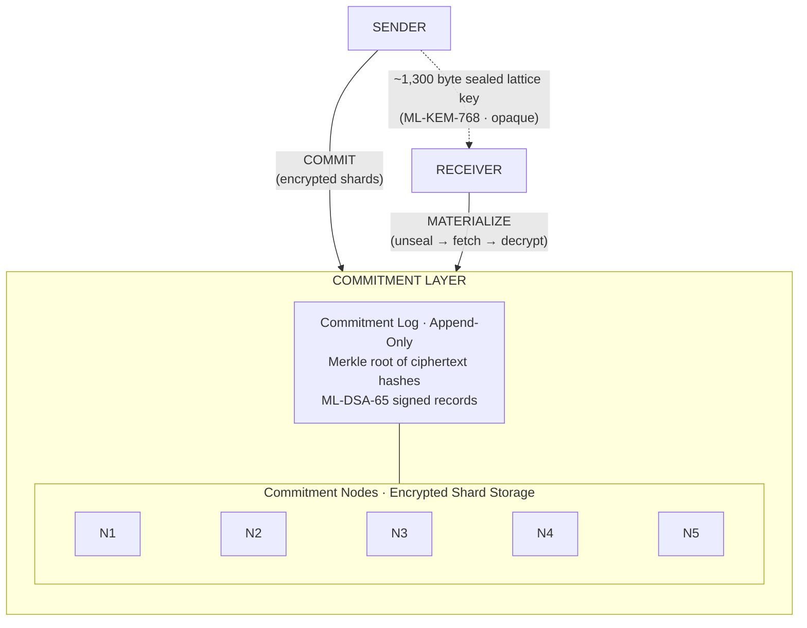
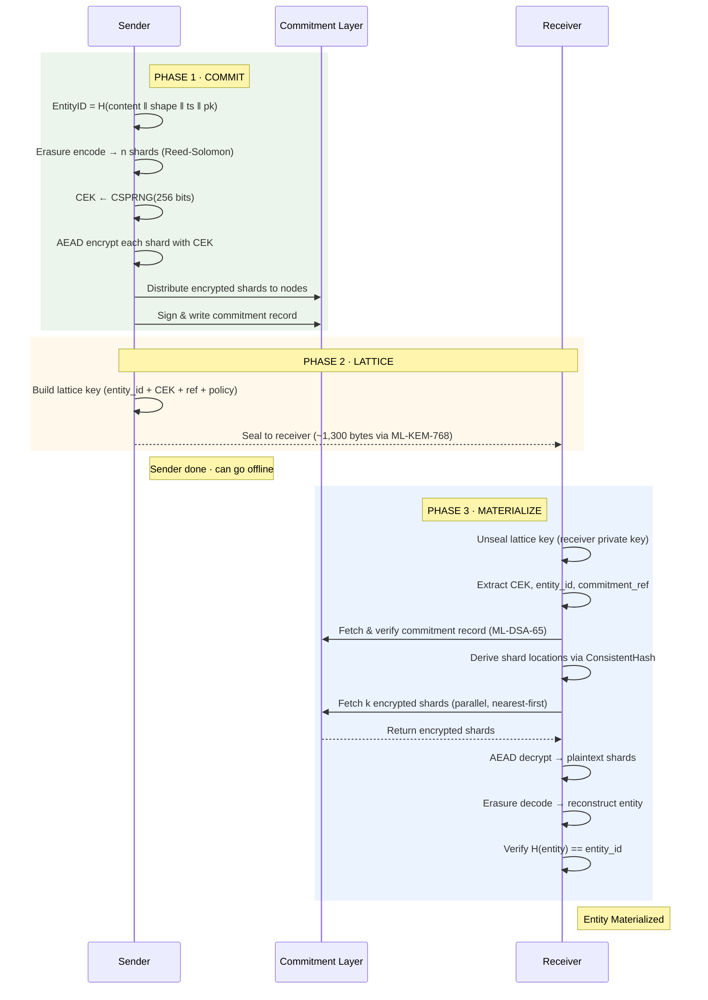
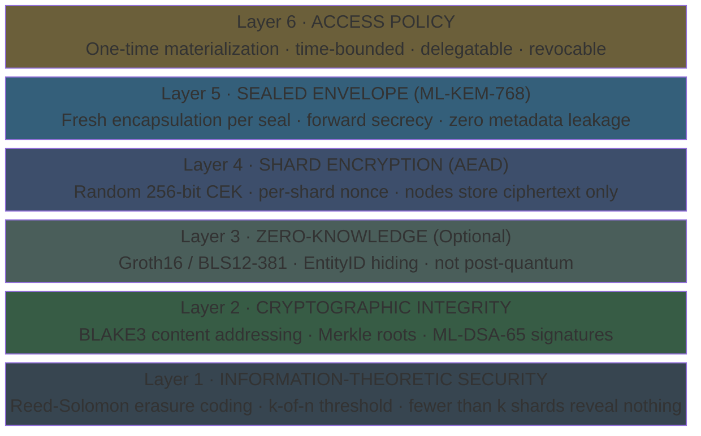
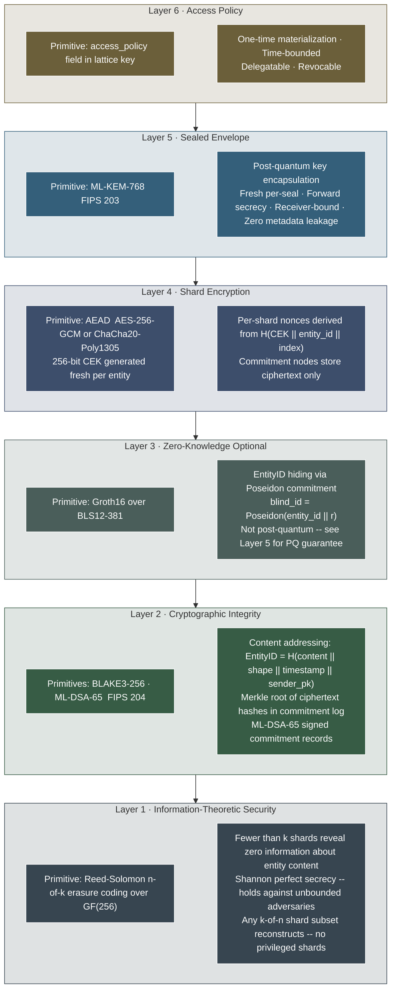

# Lattice Transfer Protocol (LTP)

### A Novel Data Transfer Protocol

> "Don't move the data. Transfer the proof. Reconstruct the truth."

---

## The Problem With Data Transfer Today

Every existing protocol — TCP/IP, HTTP, FTP, QUIC, even modern streaming protocols — operates
on the same foundational assumption:

**Data is a payload that must travel from Point A to Point B.**

This assumption chains us to three unsolvable constraints:
1. **Latency** — bound by the speed of light and routing hops
2. **Geography** — further = slower, always
3. **Compute** — larger payloads demand more processing at both ends

LTP rejects this assumption entirely.

---

## The Core Thesis

**Data transfer is not about moving bits. It is about transferring the *ability to reconstruct* a
deterministic output at a destination, verified by an immutable commitment.**

An LTP transfer consists of three atomic operations:

| Phase | Name | What Happens |
|-------|------|-------------|
| 1 | **Commit** | The sender creates an immutable, content-addressed commitment of the entity |
| 2 | **Lattice** | A minimal proof (the "lattice key") is transmitted to the receiver |
| 3 | **Materialize** | The receiver deterministically reconstructs the entity from distributed sources using the proof |

The entity is never serialized and shipped as a monolithic payload. It is **committed, proved, and reconstructed**.

---

## How It Works

### System Overview



> **Key insight:** The sender-to-receiver path carries only ~1,300 bytes regardless of entity size.
> All O(entity) work happens between sender↔network (commit) and network↔receiver (materialize),
> where nodes are geographically close to the receiver.

### Transfer Flow



### Security Stack



### Layer Breakdown



---

## Read the Full Specification

- [Protocol Whitepaper](docs/WHITEPAPER.md) — Full conceptual design
- [Architecture](docs/ARCHITECTURE.md) — System architecture and components
- [Proof-of-Concept](src/) — Reference implementation

---

## Quick Start

```
See docs/WHITEPAPER.md for the full protocol design.
See docs/ARCHITECTURE.md for system diagrams and component breakdown.
```

## License

This project uses a split license to distinguish the specification from the implementation.

| Artifact | License | What it means |
|----------|---------|---------------|
| Reference implementation (`src/`) | [Elastic License 2.0](LICENSE) | Use freely; cannot be offered as a managed/hosted service |
| Specification & documentation (`docs/`) | [CC BY-ND 4.0](LICENSE-SPEC) | Share freely; no modifications or derivative specs without permission |

Copyright (c) 2026 Jas Strokus
